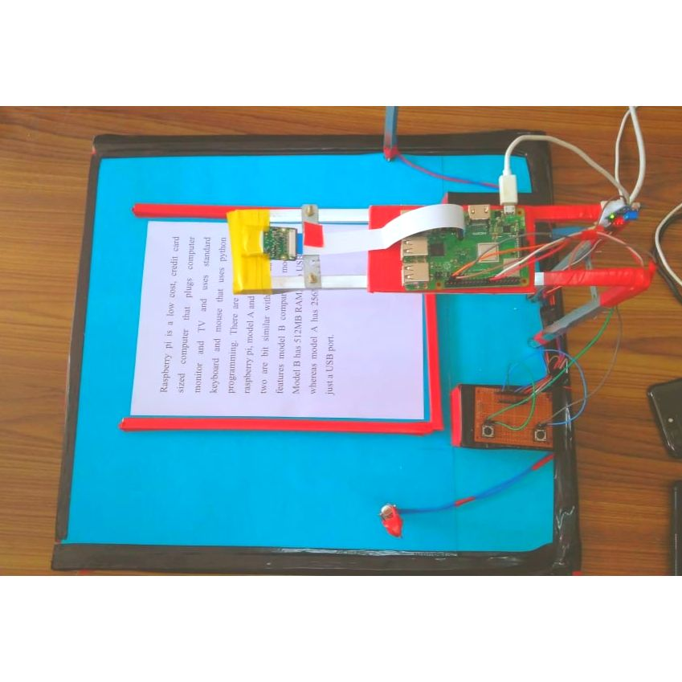
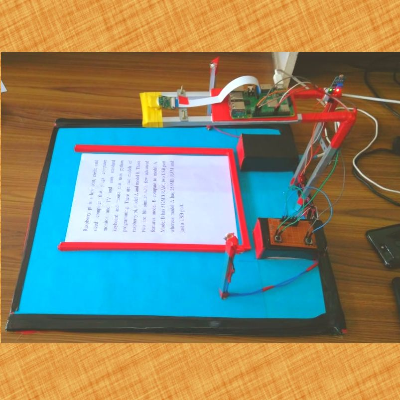
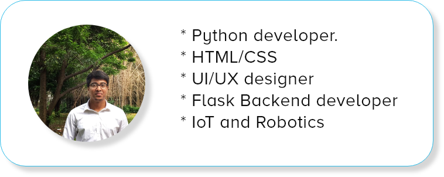
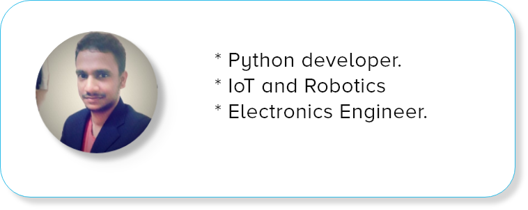

# Blind Reader &nbsp;&nbsp;&nbsp;&nbsp;&nbsp;&nbsp;&nbsp;&nbsp;&nbsp;&nbsp;&nbsp;&nbsp;&nbsp;&nbsp;       

###### Welcome to the Blind Reader project !

 Blind Reader is a portable, low-cost, reading device made for the blind people. The Braille machines are expensive and as a result are not accessible to many. <strong>Blind Reader</strong> overcomes the limitation of conventional Braille machine by making it affordable for the common masses. The system uses OCR technology to convert images into text and reads out the text by using Text-to-Speech conversion.The system supports audio output via Speakers as well as headphone. The user also has the ability to pause the audio output whenever he desires. It also has the facility to store the images in their respective book folder, thereby creating digital backup simultaneously. With this system, the blind user does not require the complexity of Braille machine to read a book. All it takes is a button to control the entire system !
  

## Dependency

#### Hardware Requirements:

- Raspberry Pi 3B.
- Pi Camera.
- Speakers / Headphones.
- Push buttons - 2.
- LDR - 1.
- LED - 4.
- Power supply - 5V,2A.

#### Software Requirements:

- Python 3.
- Python Dependencies:
    - Rpi.GPIO
	- Pygame library.
	- picamera library.
	- google-cloud.
	- time.
	- os.
	- datetime.
-Google Cloud API - Vision , Text-to-Speech

 

## Usage

- Use the following code to install the Google cloud python dependency.
 
<code>pip3 install --upgrade google-api-python-client 
pip3 install --upgrade google-cloud-vision 
pip3 install --upgrade google-cloud 
</code> 
	Use : [Google CLoud Vision API](https://developers.google.com/api-client-library/python/apis/vision/v1) for further Details.
 

- Activate <strong>Cloud Vision API</strong> and <strong>Google Cloud Text-to-Speech API</strong> by visiting the dashboard and download the Service account credentials (Json file). 

- Connect the hardware as follows:
	- Pi Camera --> Camera Slot in Raspberry Pi 3.
	- Pair Bluetooth Speaker / Insert headphone into Raspberry Pi 3 audio jack.
	- LDR --> GPIO 37.
	- 4 LEDs - GPIO 29 , 31 , 33 , 35 respectively.
	- Push Button 1 ( Camera capture ) --> GPIO 16.
	- Push Button 2 ( Play/Pause audio ) --> GPIO 18.
	 

- Use the following code to start the system: 

<code> python3 //path/to/your/final.py/file</code>
 

- Place the image to be read under the camera and press  <code>Button 1</code>  to read out a page.
  

## Demonstration
 

                 

## Resources

- [Google Cloud Platform.](https://cloud.google.com/python/docs/reference/)

- [Pygame python library.](https://www.pygame.org/news)

- [Raspberry Pi.](https://www.raspberrypi.org/)

- [Python.](https://www.python.org/)
  

## Developers

 
 
